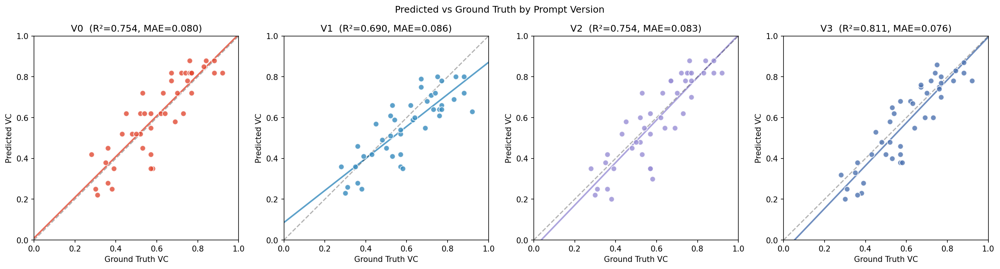

# Visual Complexity Scoring: Prompt Version Comparison (V0–V3)

**Model:** Claude Opus 4.6 | **Evaluation Set:** 43 non-anchor ground-truth images | **Date:** April 2026

---

## 1. Experiment Overview

We evaluated four progressively enriched prompt designs for predicting visual complexity (VC) scores of data visualization images. Each version adds a layer of guidance to the LLM, testing how definition clarity, dimensional decomposition, anchor-based calibration, and weighted scoring affect prediction quality.

| Version | Short Name | Key Additions |
|---------|-----------|---------------|
| **V0** | Zero-shot baseline | VC definition only; returns `vc_score` + explanation |
| **V1** | Dimension-enriched | Adds 7 dimension definitions; returns 7 sub-scores + `vc_score` (arithmetic mean) |
| **V2** | Anchor-calibrated | VC definition + 3 few-shot anchor images (vc_score only); no dimensions |
| **V3** | Full pipeline | Dimensions + calibration guidance + weighting instructions + 3 anchors (full scores) |

### Dataset: 46 Ground-Truth Images

The evaluation set consists of **46 unique images** drawn from 23 manually curated pairs (`image_pairs.xlsx`). The pairs were selected from a larger ~700-pair human comparison study and **stratified by VC score difference** to span the full difficulty range:

| Difficulty Bucket | |ΔVC| Range | # Pairs |
|-------------------|------------|---------|
| Tiny | 0.00–0.09 | 4 |
| Small | 0.10–0.19 | 4 |
| Medium | 0.20–0.39 | 9 |
| Large | 0.40+ | 5 |

The 46 images cover human-rated VC scores from 0.22 to 0.95 (mean = 0.601, std = 0.174). Three of these images serve as **few-shot anchors** in V2/V3:

| Role | Image | GT VC Score |
|------|-------|-------------|
| Low anchor | `VisC.503.6.png` | 0.22 |
| Mid anchor | `InfoVisJ.619.17.png` | 0.54 |
| High anchor | `InfoVisJ.1149.6(1).png` | 0.95 |

These 3 anchors are excluded from evaluation, leaving **43 non-anchor images** for fair comparison across all four prompt versions.

---

## 2. Summary Results

### 2.1 Performance Metrics

| Metric | V0 | V1 | V2 | V3 |
|--------|-----|-----|-----|-----|
| **Pearson *r*** | 0.868 | 0.830 | 0.868 | **0.901** |
| **Spearman *ρ*** | 0.866 | 0.816 | 0.865 | **0.896** |
| **R²** | 0.754 | 0.690 | 0.754 | **0.811** |
| **MAE** | 0.080 | 0.086 | 0.083 | **0.076** |
| **RMSE** | 0.098 | 0.107 | 0.103 | **0.091** |
| **Bias** | **+0.009** | −0.043 | −0.012 | −0.025 |
| **p (Pearson)** | < 0.0001 | < 0.0001 | < 0.0001 | < 0.0001 |

### 2.2 Distributional Statistics

| Statistic | GT | V0 | V1 | V2 | V3 |
|-----------|-----|-----|-----|-----|-----|
| Mean | 0.601 | 0.610 | 0.557 | 0.589 | 0.575 |
| Std | 0.174 | 0.200 | 0.164 | 0.209 | 0.202 |
| Min | 0.28 | 0.22 | 0.23 | 0.20 | 0.20 |
| Max | 0.92 | 0.88 | 0.80 | 0.88 | 0.87 |

---



## 3. Analysis and Observations

### 3.1 V3 is the clear winner — but the margin tells a nuanced story

V3 achieves the best performance on every regression metric: the highest Pearson correlation (0.901), highest R² (0.811), and lowest MAE (0.076) and RMSE (0.091). It explains **81% of the variance** in human judgments. This confirms that the full prompt — combining dimensional decomposition, calibration guidance, weighting instructions, and richly annotated few-shot anchors — produces the most human-aligned predictions.

However, the improvement from V0/V2 (R² ≈ 0.754) to V3 (R² = 0.811) is meaningful but not dramatic. The model already has strong intuition about visual complexity with minimal prompting.

### 3.2 The surprising competence of V0 (zero-shot)

V0 — with nothing but a one-paragraph VC definition — achieves r = 0.868 and R² = 0.754, essentially matching V2 (which uses three anchor images). This is a striking result. It suggests that Claude Opus 4.6 has a strong pre-existing concept of visual complexity that aligns well with human ratings, even without any guidance on what dimensions matter or what the scale endpoints look like.

V0 also has the **lowest bias** (+0.009), meaning its predictions are almost perfectly centered on the GT distribution. This is notable because all other versions exhibit negative bias (systematic under-prediction).

### 3.3 V1 is the weakest — dimensions without calibration can hurt

V1 adds 7 dimension definitions but no calibration guidance or anchors. Rather than improving over V0, it actually *degrades* performance (r drops from 0.868 to 0.830; R² from 0.754 to 0.690). V1 also shows the strongest negative bias (−0.043) and a compressed range (max = 0.80 vs. GT max = 0.92).

**Why dimensions alone hurt.** When the model is asked to score 7 sub-dimensions and average them, two problems emerge:
1. **Range compression**: The arithmetic mean of 7 scores naturally drifts toward the center. A visualization with very high `data_density` (0.85) but low `text_annotation` (0.05) gets pulled toward an average that under-represents its true perceptual complexity.
2. **Equal weighting is wrong**: Not all dimensions contribute equally to perceived complexity. In V1, `text_annotation` — which is often near-zero for code-heavy scientific visualizations — drags the overall score down. V3 solves this with explicit weighting instructions.

### 3.4 V2 matches V0 — anchors without dimensions add little

V2 provides three anchor images with vc_score only (no dimension breakdown). Its metrics (r = 0.868, R² = 0.754) are virtually identical to V0's. The anchors do modestly improve calibration (bias: −0.012 vs. +0.009), but the effect is small.

This suggests that for a model with strong zero-shot VC intuition, simply showing a few scored examples adds marginal value. The anchors become more useful when paired with the dimensional framework (as in V3), because they calibrate not just the overall score but the *interpretation of each dimension*.

### 3.5 The bias-accuracy trade-off

| Version | Bias | MAE |
|---------|------|-----|
| V0 | +0.009 (best) | 0.080 |
| V2 | −0.012 | 0.083 |
| V3 | −0.025 | **0.076** (best) |
| V1 | −0.043 (worst) | 0.086 (worst) |

V0 has the most unbiased predictions on average, but V3 has the lowest error per image. V3's small negative bias (−0.025) indicates it slightly under-predicts overall, but its image-level accuracy is superior. This is because V3 better *ranks* images (highest Spearman ρ) and has tighter per-image residuals, even though it is slightly conservative on average.

The calibration guidance ("push scores up") in V3 partially counteracts the downward pull of the text_annotation dimension but doesn't fully eliminate it — hence the residual negative bias.

### 3.6 Where V3 gains most: mid-range and high-complexity images

Looking at the per-image data, V3's advantage is most pronounced for images in the 0.55–0.80 GT range — moderately complex visualizations where the model needs nuanced judgment. V0 tends to over-predict in this range (positive bias), while V1 under-predicts. V3 strikes the best balance.

For very low complexity images (GT < 0.35), all versions perform similarly — the model consistently recognizes simple charts. For very high complexity images (GT > 0.85), V3 and V2 both perform well, likely because the high-complexity anchor (0.95) provides a strong calibration reference.

### 3.7 Standard deviation: V0 and V3 spread more than GT

V0 (std = 0.200) and V3 (std = 0.202) both exhibit wider spread than the GT (std = 0.174), while V1 (std = 0.164) is slightly compressed. V2 (std = 0.209) has the widest spread. The versions with anchors (V2, V3) tend to use more of the [0, 1] range, which is generally desirable — but V2 may slightly overshoot.

---

## 4. Key Takeaways

1. **Claude Opus 4.6 has strong zero-shot VC intuition.** Even with minimal prompting (V0), it achieves r = 0.87 against human ratings. This suggests the concept of "visual complexity" is well-represented in the model's training.

2. **Dimensions without calibration hurt.** V1 shows that asking the model to decompose complexity into sub-dimensions and average them — without guidance on weighting or scale — degrades performance. The arithmetic mean creates range compression and over-weights low-signal dimensions.

3. **Anchors alone add little.** V2's three anchor examples provide minimal lift over V0. The model doesn't need to be shown examples to understand the scale — it needs to be told *how to weight* different aspects of complexity.

4. **The full V3 prompt works best.** Combining dimensions, weighting, calibration guidance, and richly annotated anchors yields R² = 0.81 — a 7.5% relative improvement over the zero-shot baseline. Each component contributes, but none alone is sufficient.

5. **Residual negative bias persists.** All non-baseline versions (V1–V3) under-predict VC, with V3's bias at −0.025. This may be inherent to multi-dimensional scoring (the averaging effect) and could potentially be addressed with post-hoc bias correction or further tuning of the weighting instructions.

---

## 5. Implications for Pipeline Design

- For **production use**, V3 is recommended — it provides the highest accuracy, dimensional interpretability, and acceptable bias.
- For **rapid prototyping** or when anchor images are unavailable, V0 is a surprisingly strong fallback.
- The **weighting instruction** in V3 is a critical component. Future work could experiment with learned weights or letting the model determine weights per image.
- **Anchor selection** matters less for overall accuracy than **prompt structure** — the jump from V2 to V3 comes from calibration guidance and weighting, not from adding more anchors.

---

## Appendix A: V0 Prompt (Zero-Shot Baseline)

### System Prompt

```
You are a visual complexity (VC) scoring expert for data visualizations.

**Visual Complexity** measures the amount of detail, intricacy, and perceptual/cognitive demand
of a visualization image. It is scored on a 0–1 scale where 0 = minimal complexity and
1 = maximum complexity.

You will receive a single visualization image with NO accompanying text or comments.
Score it purely from what you see.

## Output Format
Return ONLY valid JSON (no markdown fences, no explanation outside JSON):
{
  "vc_score": <float 0-1>,
  "explanation": "<2-3 sentence justification>"
}
```

### User Prompt

```
Score the visual complexity of this visualization image.
```

### Message Structure

```
system:  [SYSTEM_PROMPT]
messages:
  user:  [image] + "Score the visual complexity of this visualization image."
```

No anchors. No dimensions. Single-turn, single-image.

---

## Appendix B: V1 Prompt (Dimension-Enriched Zero-Shot)

### System Prompt

```
You are a visual complexity (VC) scoring expert for data visualizations.

**Visual Complexity** measures the amount of detail, intricacy, and perceptual/cognitive demand
of a visualization image. It is scored on a 0–1 scale where 0 = minimal complexity and
1 = maximum complexity.

You will receive a single visualization image with NO accompanying text or comments.
Score it purely from what you see.

## Scoring Dimensions (each 0–1)

1. **data_density** — The perceived amount, richness, or depth of data content. Considers
   information volume, element quantity, and visual clutter/overlap.
2. **visual_encoding** — The variety, type, and complexity of graphical forms (shapes, lines,
   marks) and how spatial layout, scale, and encoding interpretability contribute to complexity.
3. **text_annotation** — The quantity and density of text elements (titles, axis labels, legends,
   captions, annotations, in-chart labels).
4. **domain_schema** — Whether specialized domain knowledge is needed, including dimensionality
   (2D/3D), structural complexity, and abstraction level.
5. **color_symbol** — Range, variety, and arrangement of colors, plus use of symbols, textures,
   and non-color graphical markers.
6. **aesthetic_order** — How visually cluttered, dense, or disordered the layout appears.
   Higher = more cluttered/overwhelming. A clean minimal layout scores low; a crowded layout
   with overlapping elements scores high.
7. **cognitive_load** — Overall ease or difficulty of interpreting the visualization. Considers
   interpretive difficulty, semantic clarity, and processing time/effort.

## Overall vc_score
The overall vc_score is the average of the 7 dimension scores, reflecting the image's holistic
visual complexity.

## Output Format
Return ONLY valid JSON (no markdown fences, no explanation outside JSON):
{
  "data_density": <float 0-1>,
  "visual_encoding": <float 0-1>,
  "text_annotation": <float 0-1>,
  "domain_schema": <float 0-1>,
  "color_symbol": <float 0-1>,
  "aesthetic_order": <float 0-1>,
  "cognitive_load": <float 0-1>,
  "vc_score": <float 0-1>,
  "data_density_explanation": "<1 sentence>",
  "visual_encoding_explanation": "<1 sentence>",
  "text_annotation_explanation": "<1 sentence>",
  "domain_schema_explanation": "<1 sentence>",
  "color_symbol_explanation": "<1 sentence>",
  "aesthetic_order_explanation": "<1 sentence>",
  "cognitive_load_explanation": "<1 sentence>",
  "summary": "<2-3 sentence overall description>"
}
```

### User Prompt

```
Score the visual complexity of this visualization image.
```

### Message Structure

```
system:  [SYSTEM_PROMPT]
messages:
  user:  [image] + "Score the visual complexity of this visualization image."
```

No anchors. Dimensions with equal weighting (arithmetic mean). Single-turn, single-image.

---

## Appendix C: V2 Prompt (Anchor-Calibrated, No Dimensions)

### System Prompt

Same as V0:

```
You are a visual complexity (VC) scoring expert for data visualizations.

**Visual Complexity** measures the amount of detail, intricacy, and perceptual/cognitive demand
of a visualization image. It is scored on a 0–1 scale where 0 = minimal complexity and
1 = maximum complexity.

You will receive a single visualization image with NO accompanying text or comments.
Score it purely from what you see.

## Output Format
Return ONLY valid JSON (no markdown fences, no explanation outside JSON):
{
  "vc_score": <float 0-1>,
  "explanation": "<2-3 sentence justification>"
}
```

### Anchor Messages (3 few-shot examples)

Each anchor is presented as a user→assistant turn pair before the target image:

**Anchor 1 — Low complexity (GT = 0.22)**
- Image: `VisC.503.6.png`
- User: `[image]` + `"Score the visual complexity of this visualization image."`
- Assistant: `{"vc_score": 0.22, "explanation": "Anchor image scored at 0.22."}`

**Anchor 2 — Mid complexity (GT = 0.54)**
- Image: `InfoVisJ.619.17.png`
- User: `[image]` + `"Score the visual complexity of this visualization image."`
- Assistant: `{"vc_score": 0.54, "explanation": "Anchor image scored at 0.54."}`

**Anchor 3 — High complexity (GT = 0.95)**
- Image: `InfoVisJ.1149.6(1).png`
- User: `[image]` + `"Score the visual complexity of this visualization image."`
- Assistant: `{"vc_score": 0.95, "explanation": "Anchor image scored at 0.95."}`

### User Prompt (target image)

```
Score the visual complexity of this visualization image.
```

### Message Structure

```
system:  [SYSTEM_PROMPT, cache_control: ephemeral]
messages:
  user:      [anchor_1_image] + "Score the visual complexity..."
  assistant: {"vc_score": 0.22, "explanation": "Anchor image scored at 0.22."}
  user:      [anchor_2_image] + "Score the visual complexity..."
  assistant: {"vc_score": 0.54, "explanation": "Anchor image scored at 0.54."}
  user:      [anchor_3_image] + "Score the visual complexity..."
  assistant: {"vc_score": 0.95, "explanation": "Anchor image scored at 0.95."}  [cached]
  user:      [target_image] + "Score the visual complexity..."
```

---

## Appendix D: V3 Prompt (Full Pipeline)

### System Prompt

```
You are a visual complexity (VC) scoring expert for data visualizations.

**Visual Complexity** measures the amount of detail, intricacy, and perceptual/cognitive demand
of a visualization image. It is scored on a 0–1 scale where 0 = minimal complexity and
1 = maximum complexity.

You will receive a single visualization image with NO accompanying text or comments.
Score it purely from what you see.

## Calibration Guidance
Use the full 0–1 range. Do NOT cluster scores conservatively toward the center.
- A plain single bar chart or pie chart with < 5 elements → vc_score ≈ 0.25–0.40
- A standard scatterplot, grouped bar chart, or line chart → vc_score ≈ 0.45–0.60
- A multi-panel dashboard, dense network, or multi-encoding composite → vc_score ≈ 0.70–0.85
- An extremely dense multi-view system with many coordinated panels → vc_score ≈ 0.85–0.95
IMPORTANT: If you are unsure between two scores, always choose the higher one.
Most scorers underestimate — push scores up.

## Scoring Dimensions (each 0–1)

1. **data_density** — The perceived amount, richness, or depth of data content. Considers
   information volume, element quantity, and visual clutter/overlap.
2. **visual_encoding** — The variety, type, and complexity of graphical forms (shapes, lines,
   marks) and how spatial layout, scale, and encoding interpretability contribute to complexity.
3. **text_annotation** — The sheer quantity and density of text elements (titles, axis labels,
   legends, captions, annotations, in-chart labels). Score based on volume only: more text =
   higher score, regardless of legibility.
4. **domain_schema** — Whether specialized domain knowledge is needed, including dimensionality
   (2D/3D), structural complexity, and abstraction level.
5. **color_symbol** — Range, variety, and arrangement of colors, plus use of symbols, textures,
   and non-color graphical markers.
6. **aesthetic_order** — How visually cluttered, dense, or disordered the layout appears.
   Higher = more cluttered/overwhelming. A clean minimal layout scores low; a crowded layout
   with overlapping elements scores high.
7. **cognitive_load** — Overall ease or difficulty of interpreting the visualization. Considers
   interpretive difficulty, semantic clarity, and processing time/effort.

## Overall vc_score
The overall vc_score is a weighted average reflecting the image's holistic visual complexity.
Weight dimensions as follows:
- **High weight**: data_density, visual_encoding, domain_schema, cognitive_load
  (these drive VC the most)
- **Medium weight**: color_symbol, aesthetic_order
- **Low weight**: text_annotation (text volume alone is a weak VC signal)
The vc_score should be consistent with (but not necessarily the arithmetic mean of) the
7 dimension scores. A low text_annotation score should NOT substantially pull down the
overall vc_score.

## Output Format
Return ONLY valid JSON (no markdown fences, no explanation outside JSON):
{
  "data_density": <float 0-1>,
  "visual_encoding": <float 0-1>,
  "text_annotation": <float 0-1>,
  "domain_schema": <float 0-1>,
  "color_symbol": <float 0-1>,
  "aesthetic_order": <float 0-1>,
  "cognitive_load": <float 0-1>,
  "vc_score": <float 0-1>,
  "data_density_explanation": "<1 sentence>",
  "visual_encoding_explanation": "<1 sentence>",
  "text_annotation_explanation": "<1 sentence>",
  "domain_schema_explanation": "<1 sentence>",
  "color_symbol_explanation": "<1 sentence>",
  "aesthetic_order_explanation": "<1 sentence>",
  "cognitive_load_explanation": "<1 sentence>",
  "summary": "<2-3 sentence overall description>"
}
```

### Anchor Messages (3 few-shot examples with full dimension scores)

Each anchor is presented as a user→assistant turn pair with complete dimension breakdowns:

**Anchor 1 — Low complexity: `VisC.503.6.png` (GT = 0.22)**

```json
{
  "data_density": 0.15,
  "visual_encoding": 0.10,
  "text_annotation": 0.20,
  "domain_schema": 0.15,
  "color_symbol": 0.10,
  "aesthetic_order": 0.10,
  "cognitive_load": 0.20,
  "vc_score": 0.22,
  "data_density_explanation": "Only 3 bars with error bars; very sparse data content.",
  "visual_encoding_explanation": "Standard vertical bars with simple hatching; minimal encoding variety.",
  "text_annotation_explanation": "Basic axis labels and a title present but minimal text overall.",
  "domain_schema_explanation": "Generic bar chart format; no specialized domain knowledge needed.",
  "color_symbol_explanation": "Monochrome black hatched bars on white; no color variety at all.",
  "aesthetic_order_explanation": "Clean, well-organized layout with ample whitespace.",
  "cognitive_load_explanation": "Immediately interpretable; very low effort to understand.",
  "summary": "A simple 3-bar chart with black hatching and error bars. Extremely low visual complexity across all dimensions."
}
```

**Anchor 2 — Mid complexity: `InfoVisJ.619.17.png` (GT = 0.54)**

```json
{
  "data_density": 0.55,
  "visual_encoding": 0.50,
  "text_annotation": 0.45,
  "domain_schema": 0.60,
  "color_symbol": 0.50,
  "aesthetic_order": 0.45,
  "cognitive_load": 0.55,
  "vc_score": 0.54,
  "data_density_explanation": "Moderate number of data points in a 2D scatterplot with some grouping structure visible.",
  "visual_encoding_explanation": "Points plotted in a biplot layout with directional arrows; moderate encoding complexity.",
  "text_annotation_explanation": "Axis labels and some point labels present; moderate text volume.",
  "domain_schema_explanation": "Biplot/PCA projection requires some statistical familiarity.",
  "color_symbol_explanation": "A few colors distinguish groups; moderate palette diversity.",
  "aesthetic_order_explanation": "Reasonably organized but arrows and overlapping labels add mild clutter.",
  "cognitive_load_explanation": "Requires understanding of biplots and PCA; moderate interpretation effort.",
  "summary": "A PCA biplot with directional arrows and grouped points. Moderate complexity requiring some statistical knowledge."
}
```

**Anchor 3 — High complexity: `InfoVisJ.1149.6(1).png` (GT = 0.95)**

```json
{
  "data_density": 0.90,
  "visual_encoding": 0.85,
  "text_annotation": 0.80,
  "domain_schema": 0.95,
  "color_symbol": 0.70,
  "aesthetic_order": 0.85,
  "cognitive_load": 0.95,
  "vc_score": 0.95,
  "data_density_explanation": "Multiple coordinated panels (7 views) each showing dense text and data; extremely high information volume.",
  "visual_encoding_explanation": "Mixed encoding types across panels: lists, highlighted text, bar-like indicators, tag clouds; high variety.",
  "text_annotation_explanation": "Extensive text content across all panels; the visualization IS largely text-based with highlights and annotations.",
  "domain_schema_explanation": "Specialized text analysis/collation tool; requires understanding of multi-view coordinated systems.",
  "color_symbol_explanation": "Multiple highlight colors for text segments; moderate color use with functional meaning.",
  "aesthetic_order_explanation": "Complex multi-panel layout with varied panel sizes; visually dense and somewhat overwhelming.",
  "cognitive_load_explanation": "Must track relationships across 7 coordinated views with dense text; very high cognitive demand.",
  "summary": "A multi-panel text collation tool with 7 coordinated views showing highlighted text passages, bar indicators, and tag clouds. Extremely high visual complexity requiring sustained multi-view comparison."
}
```

### User Prompt (target image)

```
Score the visual complexity of this visualization image.
```

### Message Structure

```
system:  [SYSTEM_PROMPT, cache_control: ephemeral]
messages:
  user:      [anchor_1_image] + "Score the visual complexity..."
  assistant: {full 15-field JSON for anchor 1}
  user:      [anchor_2_image] + "Score the visual complexity..."
  assistant: {full 15-field JSON for anchor 2}
  user:      [anchor_3_image] + "Score the visual complexity..."
  assistant: {full 15-field JSON for anchor 3}  [cached]
  user:      [target_image] + "Score the visual complexity..."
```

---

## Appendix E: Experimental Design Notes

- **Model**: Claude Opus 4.6 (Anthropic), accessed via `anthropic` Python SDK
- **All versions use the same user-facing prompt**: `"Score the visual complexity of this visualization image."`
- **Temperature**: Default (not explicitly set)
- **max_tokens**: V0/V2 = 800; V1/V3 = 1500
- **Prompt caching**: V2 and V3 use `cache_control: {"type": "ephemeral"}` on the system prompt and last anchor assistant message to reduce latency/cost for batch scoring
- **Anchor images** are drawn from the 46-image GT set. They are excluded from the 43-image evaluation to prevent data leakage
- **Ground truth**: NormalizedVC scores from human annotations, range [0.22, 0.95], mean = 0.601, std = 0.174
