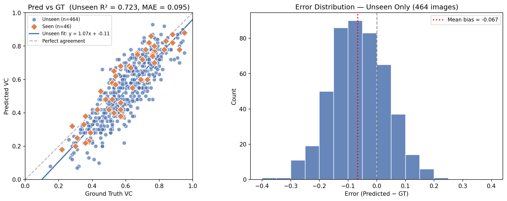
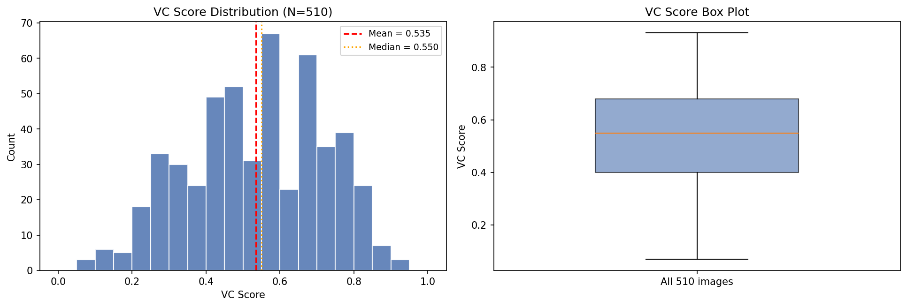
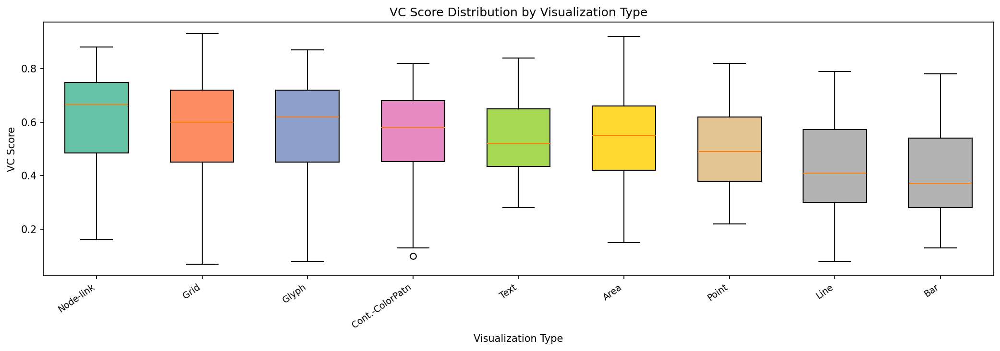
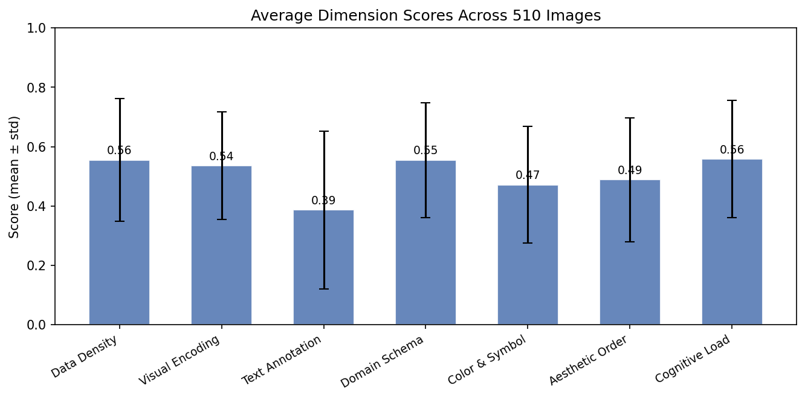
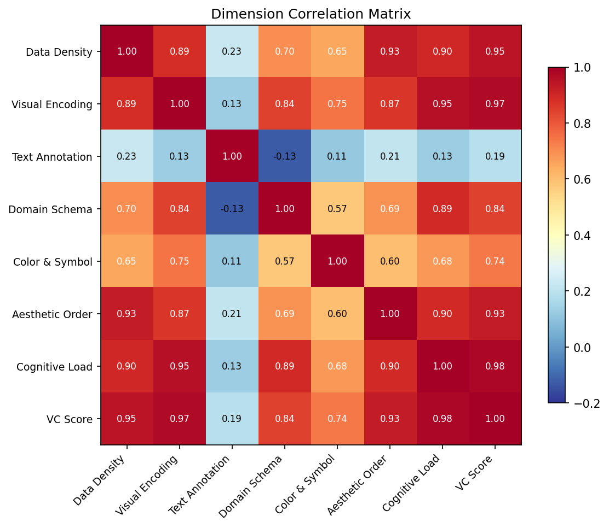
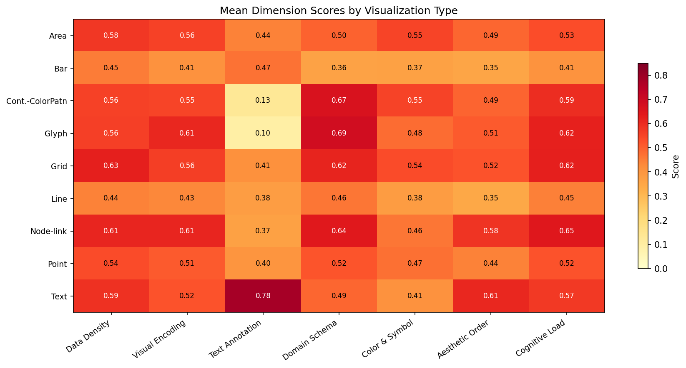

# Visual Complexity (VC) Prediction Pipeline

Automated VC scoring of 520 visualization images via Claude Opus API with few-shot anchored prompting.

---

## 1. Method

### Overview

Each image is scored by Claude Opus (`claude-opus-4-6`) on 7 VC dimensions (0–1) plus an overall `vc_score`. The model receives a system prompt defining dimensions and calibration guidance, followed by 3 few-shot anchor image–response pairs, then the target image. The prompt was iteratively refined across 3 versions using 46 ground-truth images.

### Few-Shot Anchor Images

Three hand-scored anchor images are injected as conversation-turn examples (user image → assistant JSON) spanning the low–mid–high VC range:

| Anchor Image              | VC Score | Description |
|---------------------------|----------|-------------|
| `VisC.503.6.png`          | 0.22     | Simple 3-bar chart with black hatching and error bars. |
| `InfoVisJ.619.17.png`     | 0.54     | PCA biplot with directional arrows and grouped points. |
| `InfoVisJ.1149.6(1).png`  | 0.95     | Multi-panel text collation tool with 7 coordinated views. |

### API Message Structure

```
┌─────────────────────────────────────────────────┐
│ system: SYSTEM_PROMPT                           │  ← cache_control: ephemeral
├─────────────────────────────────────────────────┤
│ user:   [anchor image 1]                        │
│         "Score the visual complexity of this..."│
│ asst:   { "data_density": 0.15, ... }           │  Anchor 1 (VC=0.22)
├─────────────────────────────────────────────────┤
│ user:   [anchor image 2]                        │
│         "Score the visual complexity of this..."│
│ asst:   { "data_density": 0.55, ... }           │  Anchor 2 (VC=0.54)
├─────────────────────────────────────────────────┤
│ user:   [anchor image 3]                        │
│         "Score the visual complexity of this..."│
│ asst:   { "data_density": 0.90, ... }           │  Anchor 3 (VC=0.95)
│                                                 │  ← cache_control: ephemeral
├─────────────────────────────────────────────────┤
│ user:   [TARGET IMAGE]                          │  ← only this varies per call
│         "Score the visual complexity of this..."│
└─────────────────────────────────────────────────┘
```

The system prompt + 3 anchor turns are **identical across all 520 calls** and cached after the first request (see [Appendix B](#appendix-b-prompt-caching)). Only the final user message changes per call.

### Prompt Evolution (V1 → V2 → V3)

| Metric      |    V1 |    V2 |    V3 |
|-------------|------:|------:|------:|
| Pearson r   | 0.832 | 0.885 | **0.912** |
| Spearman ρ  | 0.818 | 0.873 | **0.907** |
| MAE         | 0.097 | 0.083 | **0.074** |
| RMSE        | 0.120 | 0.100 | **0.089** |
| Bias        |−0.085 |−0.054 | **−0.025** |

**What changed between versions** (V1/V2 prompts were overwritten in-place and not preserved):

| Aspect | V1 ("original") | V2 ("refined") | V3 ("de-weight text") |
|--------|-----------------|----------------|-----------------------|
| Calibration guidance | None — model free to choose any range | Added explicit score ranges (e.g., simple bar chart → 0.25–0.40) | Same ranges, plus "push scores up" and "choose the higher score if unsure" |
| `text_annotation` | Scored on quality + quantity equally | Same as V1 | Changed to **volume only** (more text = higher, regardless of legibility) |
| `vc_score` weighting | Equal weight across all 7 dimensions | Same as V1 | Explicit tiers: high weight (`data_density`, `visual_encoding`, `domain_schema`, `cognitive_load`), low weight (`text_annotation`) |
| Range usage | Compressed toward center (bias = −0.085) | Better spread (bias = −0.054) | Full range utilized (bias = −0.025) |

### Production Run Configuration

| Parameter       | Value |
|-----------------|-------|
| Model           | `claude-opus-4-6` |
| Total images    | 520 (510 after VisType filtering) |
| Image source    | GitHub URLs (`AllDataResize/`) |
| Max tokens      | 1,500 |
| Concurrency     | Async with semaphore-bounded workers |

---

## 2. Ground Truth Validation

The V3 prompt was developed using 3 anchor images + 46 calibration images. Of these, **46 have ground-truth NormalizedVC** (the 3 anchors are not in the GT source). To report unbiased prediction quality, we split into:

- **Seen** (46 images): calibration set used during prompt development (includes anchors where GT is available).
- **Unseen** (464 images): purely predicted, never used for prompt tuning.

| Split                | Pearson r | Spearman ρ | R²    | MAE   | RMSE  | Bias   |
|----------------------|-----------|------------|-------|-------|-------|--------|
| All (n=510)          | 0.856     | 0.852      | 0.733 | 0.093 | 0.114 | -0.063 |
| Seen (n=46)          | 0.912     | 0.907      | 0.831 | 0.074 | 0.089 | -0.025 |
| Unseen (n=464)       | 0.851     | 0.847      | 0.723 | 0.095 | 0.116 | -0.067 |



The unseen split shows Pearson r = 0.851 with a slight negative bias (-0.067), indicating the prompt generalizes well beyond the calibration set. The error distribution is approximately symmetric and centered near zero.

---

## 3. File Reference

| File | Description |
|------|-------------|
| `scripts/_vc_score_api_v3.py` | Main API scoring script (V3 prompt, async, caching) |
| `vc_api_scores/vc_scores.csv` | Production scores (520 rows, 7 dims + vc_score) |
| `vc_api_scores/vc_explanations.csv` | Per-dimension explanations + summary |
| `Claude_vc_prediction/gt_all_46.csv` | 46 calibration GT images |
| `Claude_vc_prediction/VC_520_Analysis.ipynb` | Production analysis notebook |
| `Claude_vc_prediction/VC_API_Calibration.ipynb` | V1/V2/V3 calibration diagnostics |
| `vc_api_46gt_v1/` | V1 calibration run output |
| `vc_api_46gt_v2/` | V2 calibration run output |
| `vc_api_46gt_v3/` | V3 calibration run output |

---
---

# Appendices

## Appendix A: Full V3 System Prompt

```
You are a visual complexity (VC) scoring expert for data visualizations.

**Visual Complexity** measures the amount of detail, intricacy, and perceptual/cognitive
demand of a visualization image. It is scored on a 0–1 scale where 0 = minimal complexity
and 1 = maximum complexity.

You will receive a single visualization image with NO accompanying text or comments.
Score it purely from what you see.

## Calibration Guidance
Use the full 0–1 range. Do NOT cluster scores conservatively toward the center.
- A plain single bar chart or pie chart with < 5 elements → vc_score ≈ 0.25–0.40
- A standard scatterplot, grouped bar chart, or line chart → vc_score ≈ 0.45–0.60
- A multi-panel dashboard, dense network, or multi-encoding composite → vc_score ≈ 0.70–0.85
- An extremely dense multi-view system with many coordinated panels → vc_score ≈ 0.85–0.95
IMPORTANT: If you are unsure between two scores, always choose the higher one.
Most scorers underestimate — push scores up.

## Scoring Dimensions (each 0–1)

1. **data_density** — The perceived amount, richness, or depth of data content.
   Considers information volume, element quantity, and visual clutter/overlap.
2. **visual_encoding** — The variety, type, and complexity of graphical forms
   (shapes, lines, marks) and how spatial layout, scale, and encoding
   interpretability contribute to complexity.
3. **text_annotation** — The sheer quantity and density of text elements
   (titles, axis labels, legends, captions, annotations, in-chart labels).
   Score based on volume only: more text = higher score, regardless of legibility.
4. **domain_schema** — Whether specialized domain knowledge is needed,
   including dimensionality (2D/3D), structural complexity, and abstraction level.
5. **color_symbol** — Range, variety, and arrangement of colors, plus use of
   symbols, textures, and non-color graphical markers.
6. **aesthetic_order** — How visually cluttered, dense, or disordered the layout
   appears. Higher = more cluttered/overwhelming. A clean minimal layout scores
   low; a crowded layout with overlapping elements scores high.
7. **cognitive_load** — Overall ease or difficulty of interpreting the
   visualization. Considers interpretive difficulty, semantic clarity, and
   processing time/effort.

## Overall vc_score
The overall vc_score is a weighted average reflecting the image's holistic visual
complexity. Weight dimensions as follows:
- **High weight**: data_density, visual_encoding, domain_schema, cognitive_load
- **Medium weight**: color_symbol, aesthetic_order
- **Low weight**: text_annotation (text volume alone is a weak VC signal)
The vc_score should be consistent with (but not necessarily the arithmetic mean of)
the 7 dimension scores. A low text_annotation score should NOT substantially pull
down the overall vc_score.

## Output Format
Return ONLY valid JSON (no markdown fences, no explanation outside JSON):
{
  "data_density": <float 0-1>,
  "visual_encoding": <float 0-1>,
  "text_annotation": <float 0-1>,
  "domain_schema": <float 0-1>,
  "color_symbol": <float 0-1>,
  "aesthetic_order": <float 0-1>,
  "cognitive_load": <float 0-1>,
  "vc_score": <float 0-1>,
  "data_density_explanation": "<1 sentence>",
  "visual_encoding_explanation": "<1 sentence>",
  "text_annotation_explanation": "<1 sentence>",
  "domain_schema_explanation": "<1 sentence>",
  "color_symbol_explanation": "<1 sentence>",
  "aesthetic_order_explanation": "<1 sentence>",
  "cognitive_load_explanation": "<1 sentence>",
  "summary": "<2-3 sentence overall description>"
}
```

---

## Appendix B: Prompt Caching

The Anthropic API supports **prompt caching** to avoid re-sending identical prefix content on every call. Since all 520 requests share the same system prompt and 3 anchor image/response pairs, caching reduces token costs significantly.

### How It Works

The **system prompt** is marked with `cache_control: {"type": "ephemeral"}`:
```python
system=[{"type": "text", "text": SYSTEM_PROMPT, "cache_control": {"type": "ephemeral"}}]
```

The **last anchor assistant message** (3rd few-shot response) is also marked:
```python
last_msg['content'] = [{
    "type": "text",
    "text": last_msg['content'],
    "cache_control": {"type": "ephemeral"}
}]
```

### Why Prefix-Based Caching

Anthropic's caching is **prefix-based** — it caches everything from the start up to the last `cache_control` block. The two markers serve complementary roles:

- **System prompt marker**: ensures the system text is cached even if anchor image loading fails.
- **Last anchor marker**: extends the cached prefix to include all 3 few-shot examples.

On the 2nd call onward, the API performs a **cache read** for the full prefix (~5,000+ tokens) and only processes the new target image. Cache reads cost 10% of normal input token pricing.

---

## Appendix C: Distribution & Dimension Analysis

### Overall VC Score Distribution

- **Mean ± std**: 0.531 ± 0.168
- **Range**: [0.03, 0.93]



### VC by Visualization Type

9 core visualization types retained (510 images):

| VisType          | Count |
|------------------|------:|
| Node-link        |    66 |
| Area             |    65 |
| Grid             |    65 |
| Glyph            |    64 |
| Point            |    58 |
| Bar              |    51 |
| Text             |    51 |
| Line             |    48 |
| Cont.-ColorPatn  |    42 |

Excluded (10 images): Schematic (7), Bar and point (1), Table (1), Area and Text (1).



### Dimension-Level Statistics

| Dimension         | Mean  | Std   |
|-------------------|-------|-------|
| Data Density      | 0.56  | 0.19  |
| Visual Encoding   | 0.55  | 0.17  |
| Text Annotation   | 0.47  | 0.17  |
| Domain Schema     | 0.55  | 0.19  |
| Color & Symbol    | 0.48  | 0.19  |
| Aesthetic Order   | 0.52  | 0.18  |
| Cognitive Load    | 0.57  | 0.18  |

*(Approximate values — see notebook for exact stats.)*







---

## Appendix D: Why Conversation-Turn Anchoring

A natural question is whether the 3 few-shot anchors could be combined into a single text message (e.g., "Here are 3 reference images with their scores: ...") rather than using separate user→assistant conversation turns.

### Why separate turns are preferred

1. **Images require user messages.** The Claude API only accepts images inside user-role messages. Placing all 3 anchor images in a single user message would make it ambiguous which image corresponds to which JSON response.

2. **Behavioral anchoring through synthetic history.** When the model sees that it "already answered" correctly 3 times in prior assistant turns, it follows the same scoring pattern much more reliably than if the examples are described in prose. The alternating user→assistant turn structure is the canonical few-shot format for chat-based LLM APIs — it leverages the model's in-context learning from its own prior responses.

3. **Exact output format teaching.** Each assistant turn contains the full JSON output with all 7 dimension scores, explanations, and summary. The model learns the precise structure by having "produced" it 3 times, rather than merely reading a format specification.

### The alternative (and why it's weaker)

You *could* describe the anchors in text within the system prompt: "Image A is a simple bar chart, VC = 0.22..." This would work for non-visual tasks, but here the model would be scoring based on text descriptions rather than seeing the actual images. The conversation-turn approach ensures the model has seen real visual examples at each complexity level before scoring the target.
